<h1 align="center">Hi, I'm Gurusaran 👋</h1>

  <strong>Data Analyst · Applied Data Scientist · AI Engineering</strong>

  I build data and AI systems — from analytics and machine-learning decision platforms
  to production data pipelines and LLM applications using RAG, vector search, APIs, and evaluation.

  
  

---

## Contribution Activity

  

---

# Featured Projects

## 🚀 [Customer Intelligence & AI Decision Platform](https://github.com/GURUSARAN01/customer-intelligence-platform)

A production-style decision platform that helps an e-commerce marketing team identify valuable customers, predict purchase likelihood, select campaign targets, and estimate expected profit.

**What it demonstrates**

- Customer segmentation and behavioural feature engineering
- Purchase-propensity prediction for the next 30 days
- Campaign targeting based on expected business value
- Production-oriented Python project structure
- Automated testing
- API and application layers

**Stack:**  
`Python` `Pandas` `Scikit-learn` `FastAPI` `Streamlit` `Docker`

[View flagship project →](https://github.com/GURUSARAN01/customer-intelligence-platform)

---

## 🧠 [RAG Reliability Lab](https://github.com/GURUSARAN01/mini-rag-reliability-lab)

A retrieval-focused LLM application for document question answering, built to measure how chunking and retrieval choices affect RAG quality rather than stopping at a basic PDF chatbot.

**What it demonstrates**

- PDF ingestion and text extraction
- Configurable document chunking
- Local embeddings and semantic vector search
- Persistent ChromaDB vector storage
- Gemini-grounded document answers
- FastAPI backend with Pydantic validation
- Retrieval benchmarking and latency measurement
- Controlled RAG experiments

**Measured result:** improved **Retrieval Hit@3 from 70% to 80%** by optimizing chunk size and overlap.

**Stack:**  
`Python` `Gemini` `RAG` `Embeddings` `ChromaDB` `FastAPI` `Pydantic` `uv`

[View project →](https://github.com/GURUSARAN01/mini-rag-reliability-lab)

---

## 🏗️ [Medallion ETL & Scheduling](https://github.com/GURUSARAN01/medallion-etl-scheduling)

An end-to-end data pipeline using Bronze, Silver, and Gold layers to convert raw data into validated, analytics-ready outputs.

**Highlights**

- Layered medallion architecture
- Scheduled ingestion workflows
- Data-quality transformations
- Analytics-ready outputs
- ML-ready datasets

**Stack:**  
`Python` `ETL` `Apache Airflow` `Data Engineering`

[View project →](https://github.com/GURUSARAN01/medallion-etl-scheduling)

---

## 🌦️ [Stuttgart Weather Pipeline](https://github.com/GURUSARAN01/weather-pipeline)

An automated ETL pipeline that retrieves weather data, transforms it, and loads it into PostgreSQL using a scheduled Apache Airflow workflow.

**Highlights**

- Scheduled Airflow DAG
- External API ingestion
- Data validation and transformation
- PostgreSQL persistence
- Dockerized environment

**Stack:**  
`Python` `Apache Airflow` `Docker` `PostgreSQL`

[View project →](https://github.com/GURUSARAN01/weather-pipeline)

---

  <a href="https://github.com/GURUSARAN01?tab=repositories">
    <strong>Explore all repositories →</strong>
  </a>

---

# AI Engineering Focus

Currently expanding my applied AI engineering skills through hands-on projects and DataCamp's **Associate AI Engineer for Developers** track.

Current areas of focus include:

**LLM Applications**  
LLM APIs · Prompt Engineering · Structured Outputs · Context Engineering · Tool Calling

**Retrieval-Augmented Generation**  
Embeddings · Vector Search · Chunking · ChromaDB · Pinecone · Retrieval Evaluation

**AI Frameworks & Ecosystem**  
LangChain · Hugging Face · OpenAI API · Gemini API · MCP

**AI Engineering**  
FastAPI · Pydantic · REST APIs · Evaluation · Reliability · Production-oriented AI application design

---

# Tech Stack

## Generative AI & LLM Engineering

  
  
  
  
  
  
  
  
  
  
  
  

## Data Analysis & Machine Learning

  
  
  
  
  
  
  

## Backend & AI Applications

  
  
  
  
  
  

## Data Engineering & Development

  
  
  
  
  
  

---

# Let's Connect

I am currently based in Germany and open to full-time opportunities across
<strong>Data Analytics, Applied Data Science, AI Engineering, Business Intelligence, and Data & AI roles.</strong>

  
  
  

  <strong>📍 Germany</strong>
  &nbsp;&nbsp;·&nbsp;&nbsp;
  <strong>Open to opportunities</strong>

